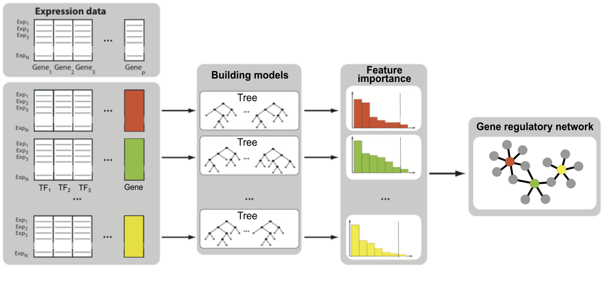

In this workshop we are going to use tree-based methods to construct Gene Regulatory Networks (GRNs).

## Introduction



The expression of each gene is regulated by a set of transcription factors (TFs). If a level of TF expression is changed (e.g. a TF is knocked-down), the expression level of it's downstream target genes will be affected. We can therefore build a model that predicts expression of a particular gene based on the expression of it's (potential) regulator TFs. The TFs with higher importance in the model are more likely to be true regulators of that particular gene. By building such models for the group of genes we are interested in, and linking genes to TFs, we can obtain simple co-expression based Gene Regulatory Networks (GRNs).

Tree based methods are particularly suitable for this problem because:  

* they make essentially no assumptions about the nature of the relationships between TF and gene expression (which can be non-linear),  

* they can potentially capture high-order conditional dependencies between expression patterns,  

* they can handle having many features,  

* their interpretability allows direct selection of important TFs.  

 
## Setup

```{r setup,  message=FALSE, warning=FALSE}
library(data.table)
library(stringr)
library(ggplot2)
library(caret)
library(rpart)
library(rpart.plot)
library(ipred)
library(ranger)
library(party)

theme_set(theme_linedraw())
```

## Data

GTEx portal contains gene expression data for various human tissues, you can access the data [here](https://www.gtexportal.org/home/datasets#filesetFilesDiv131).  

We will use transcript-per-million (TPM) normalized gene counts from 578 lung samples. You can download the data directly from GTEx or load the local copy.

```{r eval=FALSE}
# download data from GTEx portal
url <- "https://storage.googleapis.com/gtex_analysis_v8/rna_seq_data/gene_reads/gene_reads_2017-06-05_v8_lung.gct.gz"
dt <- fread(url)
```

```{r}
# load local copy of data
dt <- fread("data/gene_tpm_2017-06-05_v8_lung.gct.gz")
```

```{r}
dim(dt)
dt[1:10,1:10]
```

There are 56,200 genes from 578 lung samples in our data.  

Since we will only use TFs as variables in our model, we will include additional column to specify if the gene is a TF or not. You can download a list of 1639 human TFs from the curated database [here](http://humantfs.ccbr.utoronto.ca/download.php), or again, load a local copy of this data.  

```{r eval=FALSE}
# download TF data
url <- "http://humantfs.ccbr.utoronto.ca/download/v_1.01/TFs_Ensembl_v_1.01.txt"
tfs <- readLines(url)
```
```{r}
# load local copy of TF data
tfs <- readLines("data/TFs_Ensembl_v_1.01.txt")
head(tfs)
length(tfs)

# strip transcript ID from GTEx data
dt[, Name := str_remove(Name, "\\.\\d+$")]

# add TF info
dt[,TF := ifelse(Name %in% tfs, TRUE, FALSE)]
setcolorder(dt, c("id","Name","Description","TF"))

# we will use more informative gene names instead of ensembl IDs
dt[,Description:=str_replace(Description,"-","_")] # - causes formula to break
tfs <- dt[TF == TRUE, Description]
```

Let's do some exploratory data analysis.

```{r}
# extract only TPM values
tpm <- dt[,-c(1:4)]
# transpose to have observations in rows and features in columns
tpm <- as.data.frame(t(tpm))
colnames(tpm) <- dt$Description
quants <- t(apply(tpm, 1, quantile))
head(quants)
```

We can remove genes that are not expressed in any sample.

```{r warning=FALSE, message=FALSE, fig.height=6, fig.width=8}
# remove genes not expressed in any sample
not_expressed <- which(colSums(tpm) == 0)
length(not_expressed)
tpm <- tpm[, -not_expressed]
quants <- t(apply(tpm, 1, quantile))
head(quants)
```

Next we log transform the data and remove genes that are very lowly expressed in most of the samples. 

```{r}
# log transform
tpm <- log(tpm+1)
quants <- t(apply(tpm, 1, quantile))
head(quants)

# remove lowly expressed genes
hist(colSums(tpm), breaks = 50); abline(v=100, col="red")
low_expressed <- which(colSums(tpm) < 100)
sum(names(low_expressed) %in% tfs)
tpm <- tpm[, -low_expressed]

# how many TFs (i.e. variables) we have left?
tfs <- tfs[tfs %in% colnames(tpm)]
length(tfs)

```
```{r include=FALSE, eval=FALSE}
# TPM distribution for TFs vs non-TFs
dtm <- reshape2::melt(tpm, value.name = "TPM")
dtm$TF <- ifelse(dtm$variable %in% tfs, TRUE, FALSE)
gp <- ggplot(dtm, aes(TPM, fill=TF)) + 
  geom_histogram(bins=100) + 
  scale_x_log10() +
  scale_fill_viridis_d() +
  facet_grid(TF~., scales = "free_y", labeller = label_both) +
  theme(legend.position = "none") 
gp
```

**Note**: A more sophisticated feature selection methods are available, they will be covered in tomorrow's lectures.

Split the data into train and test samples.

```{r}
set.seed(1950)
tpm_train_id <- sample(1:nrow(tpm), size = 0.9 * nrow(tpm))
tpm_train <- tpm[tpm_train_id, ]; nrow(tpm_train)
tpm_test  <- tpm[-tpm_train_id, ]; nrow(tpm_test)
```

First we will fit different regression trees to predict individual genes expression. We will build models for **SFTPA1**, a member of SFTP gene family encoding lung surfactant proteins. Same approach can then be applied to all other genes.

```{r}
# outcome variable
gene <- "SFTPA1"

# predictor variables
tfs <- setdiff(tfs, gene)
```

***

## Regression Tree

We will first use `rpart::tree()` function to fit decision tree model.

```{r fig.height=5, fig.width=8}
require(rpart)

set.seed(1950)

# build tree
tpm_tree <- rpart(
  formula = as.formula(paste(gene, "~ .", collapse = " ")),
  data = tpm_train[,c(gene,tfs)],
  method = "anova" # for regression
)

# plot tree
require(rpart.plot)
rpart.plot(tpm_tree)
```

The tree is showing the percentage of data that fall to each node, and the average log transformed TPM for corresponding branch.

**QUESTION:** Why is it important to set hyperparameters for tree building?

`rpart` implementation of tree building algorithm automatically performs a cross validation for a range of cost complexity values `cp` used to prune the tree. We can look at reduction in cross-validation error with increased number of splits.

```{r fig.height=4, fig.width=6}
plotcp(tpm_tree)
```

Note that this CV error is equivalent to predicted residual error sum of squares (PRESS); it is not equivalent to the root mean squared error (RMSE) which we will calculate later.

```{r}
# get stats for different cp values
tpm_tree$cptable
```

In addition to the cost complexity `cp`, other `rpart` parameters we can tune are:  

* `minsplit`, the minimum number of data points required to attempt a split before it is forced to create a terminal node (default is 20)  
* `maxdepth`, the maximum number of internal nodes between the root node and the terminal nodes (default is 30).  

In order to automatically tune the values of decision tree parameters, we create a search grid and iterate over it. 

```{r}
hyper_grid <- expand.grid(
  minsplit = seq(20, 50, 2),
  maxdepth = seq(20, 50, 2)
)
# total combinations
nrow(hyper_grid)
```

Note that this is many combinations to test for, and it will take a lot of time. For this reason, don't run the code below, we will load pre-calculated grid search results instead. 

```{r message=FALSE, eval=FALSE}
# loop over grid search
set.seed(1950)
tpm_list <- lapply(1:nrow(hyper_grid), function(i) {
  
  # train a model 
  tpm_tree <- rpart(
    formula = as.formula(paste(gene, "~ .", collapse = " ")),
    data = tpm_train[, c(gene,tfs)],
    method  = "anova",
    control = list(
      minsplit = hyper_grid$minsplit[i], 
      maxdepth = hyper_grid$maxdepth[i]
    )
  )
  
  # get error
  tpm_tree$cptable[which.min(tpm_tree$cptable[,"xerror"]),]

  })

# merge results
tpm_cp <- do.call('rbind', tpm_list)

# add results to grid
hyper_grid <- cbind(hyper_grid, tpm_cp)

```

After building all the models, we select the parameters with lowest CV error.

```{r fig.height=6, fig.width=6}
hyper_grid <- fread(sprintf("data/hypergrid.tree.%s.csv",gene))
head(hyper_grid[order(xerror)])

# plot grid search results
ggplot(hyper_grid, aes(minsplit, maxdepth, fill = xerror)) + 
  geom_tile() + coord_fixed() + scale_fill_viridis_c(direction = -1)
```

**QUESTION:** Compare the error for top model to that calculated for the first tree built with the default parameters.  

**TASK:** Use the best parameters to build the final model.

```{r}
# build the model using best parameters from grid search


```

Use this model for prediction with test data.

```{r eval=FALSE, fig.width=6, fig.height=6}
pred <- predict(tpm_best_tree, newdata = tpm_test[, tfs])
RMSE(pred = pred, obs = tpm_test[, gene])

pred_df <- data.frame(predicted=pred, actual=tpm_test[, gene])
ggplot(pred_df, aes(predicted, actual)) + 
  geom_point() + 
  geom_smooth(method='lm', formula=y~x)
```

## Bagging

The main parameter for bagging is the number of trees to average (`nbagg`, default is 25). Increasing this value results in lower error, but after the initial drop, it soon becomes stable.   

**QUESTION:** What will happen if we keep increasing number of trees used in bagging?

### `ipred`

We can train a regression tree with bagging similarly to training a single tree, using `ipred::bagging` function. We will build models with different number of averaged trees, and retrieve out-of-the-bag OOB error for each (`ipred` does not perform CV).   

```{r message=FALSE, eval=FALSE}
require(ipred)

set.seed(1950)

# get OOB errors for models with range of bagged trees
nbagg <- seq(10, 200, 2)

rmse <- sapply(nbagg, function(i) {
  bt <- bagging(
    formula = as.formula(paste(gene, "~ .", collapse = " ")),
    data = tpm_train[,c(gene,tfs)],
    coob = TRUE,
    nbagg = i
  )
  bt$err
})

rmse_df <- data.frame(nbagg, rmse)
```

As this is time-consuming, we can load pre-calculated grid search results.

```{r}
# load precalculated grid search values
rmse_df <- fread(sprintf("data/hypergrid.bagging.%s.csv",gene))
ggplot(rmse_df, aes(nbagg, rmse)) + 
  geom_line()
```

**TASK:** Build a model using best performing `nbagg` value. This will take a bit longer than building a single tree (e.g. it takes a few minutes on a PC with 8 cores and 14GB RAM).

```{r}
# fit model

```

**TASK:** Use bagging model for prediction with test data.

```{r}
# prediction

```

### `caret`

Alternatively, we can use `caret::train()` function which can fit a variety of different models (238, to be precise, see info [here](https://topepo.github.io/caret/available-models.html)), including bagging trees (see `names(getModelInfo())`). It's advantages are that it can automatically perform cross-validation and calculate variable importance.  

```{r}
require(caret)

# set up a 10-fold cross validation
ctrl <- trainControl(method = "cv",  number = 10) 

# CV bagged model
bagging_tree <- caret::train(
  x = tpm_train[,tfs],
  y = tpm_train[,gene],
  method = "treebag",
  num.trees = rmse_df[which.min(rmse_df$rmse),"nbagg"],
  trControl = ctrl,
  importance = TRUE
)
```

Note that we could in theory use the same formula syntax as with `pred`, however, `ipred` has a problem with formula parsing of some of the column names, so we specify `x` and `y` values directly)

```{r fig.height=6, fig.width=4}
# assess results
bagging_tree

# plot most important variables
plot(varImp(bagging_tree), 30)  
```

## Random Forest

We can use `caret::train()` with fast `ranger` implementation of Random Forest (`method = "ranger"`), to train the model and do cross validation on the fly.

There are several parameters to specify for Random Forest:

* `splitrule` specifies how splits are decidd, if we are training a regression e.g. `splitrule = "variance"` or classification (e.g. `splitrule = "gini"`) model  
* `mtry`, number of randomly selected variables; recommended default values are p/3 for regression problems and sqrt(p) for classification problems, where p is total number of variables
* `min.node.size`, minimal node size (default is 5 for regression)

**TASK:** We construct the hyperparameter grid to iterate over and pass it to `caret::train()` as `tuneGrid`. As this may take a lot of time, don't do a very extensive search!

```{r eval=FALSE}
# set up cross validation
ctrl <- trainControl(...) 

# parameter grid search
hyper_grid <- expand.grid(...)

# total number of combinations
nrow(hyper_grid)

# build models 
rf_tree <- caret::train(...)
```

Inspect results of grid search. You can load precalculated, more extensive grid search results here.

```{r fig.height=6, fig.width=5}
# load grid search results
grid_res <- fread(sprintf("data/hypergrid.rf.%s.csv",gene))

# plot
ggplot(grid_res, aes(min.node.size, mtry, fill = RMSE)) + 
  geom_tile() + scale_fill_viridis_c(direction = -1)

# top parameter combinations
grid_res[order(RMSE)][1:5]
```

**TASK:** Select best parameters obtained from grid search and build the model.

```{r}
# build random forest model

```

Extract variable importance for model.

```{r}
# most important variables

```

Use Random Forest model for prediction with test data.

```{r}
# predict

```

## Conditional Trees

The only parameter to tune for conditional trees is number of randomly selected variables `mtry`.  

```{r eval=FALSE}
# set up cross validation
ctrl <- trainControl(method = "cv",  number = 5) 

# parameter grid search
hyper_grid <- expand.grid(
  mtry = seq(1050, 1250, by = 50)
)

# total number of combinations
nrow(hyper_grid)

# build models 
crf_tree <- caret::train(
  x = tpm_train[,tfs],
  y = tpm_train[,gene],
  method = "cforest",
  trControl = ctrl,
  tuneGrid = hyper_grid
)
grid_res <- crf_tree$results
```

**TASK:** Select best parameters obtained from grid search and build the model. This takes longer than standard Random Forest (e.g. ~10 minutes on a PC with 8 cores and 14GB RAM)

```{r}
# set up cross validation

# parameter grid with fixed best values

# build model

```

**TASK:** Extract variable importance for model.

```{r}
# most important variables

```

**TASK:** Prediction using Conditional Random Forest.

```{r}
# predict

```

## Boosting

Important parameters to tune for boosting are:  

* `mstop` number of boosting iterations,  
* `maxdepth` the maximum number of internal nodes between the root node and the terminal nodes,  
* `nu` learning rate, scales the contribution of each tree.

**QUESTION**: How will low or high `nu` value affect model performance?

```{r eval=FALSE}
# set up cross validation
ctrl <- trainControl(method = "cv",  number = 5) 

# parameter grid search
hyper_grid <- expand.grid(
  mstop = seq(100, 200, 50),
  maxdepth = seq(10, 30, 5),
  nu = c(0.01, seq(0.1, 0.5, 0.1))
)

# total number of combinations
nrow(hyper_grid)

# build models
bst_tree <- caret::train(
  x = tpm_train[,tfs],
  y = tpm_train[,gene],
  method = "bstTree",
  trControl = ctrl,
  tuneGrid = hyper_grid
)

# save
grid_res <- bst_tree$results
```

**TASK:** Select best parameters obtained from grid search and build the model.

```{r}
# set up a 10-fold cross validation

# parameter grid with fixed best values

# build a model

```

**TASK:** Extract variable importance for model.

```{r}
# most important variables

```

**TASK:** Use Boosting model for prediction with test data.

```{r}
# predict

```

## Downstream analysis

The models described above are fit in the same way for other genes of interest. Here we will briefly inspect their overall performance.

Load pre-calculated model errors for different genes and order them by increasing RF RMSE.

```{r}
dt = fread("data/20220919112028.rmse.txt")
setnames(dt, c("genes","model","rmse"))
dt[, model:=factor(model, levels=c("decision_tree","bagging","random_forest","boosting"))]
dt[, genes:=factor(genes, levels=unique(dt[model=="random_forest"][order(-rmse)]$genes))]
setorder(dt,genes,rmse)
```

Ensemble methods outperform single decision tree in most cases.

```{r fig.width=6, fig.height=10}
ggplot(dt, aes(genes, rmse, color=model)) +
  geom_line(aes(group=model)) +
  geom_point() +
  theme(
    panel.grid.major.x = element_blank(), 
    axis.ticks.length.x = unit(0,"mm")
  ) + coord_flip()
```

Finally, we can use variable importance to prioritize genes for building a Gene Regrulatory Network. The choice of how many TFs to include in the network is a bit arbitrary at this point.

```{r}
var_imp <- fread("data/20220908101042.varimp.rf.txt")
setorder(var_imp, gene, -varimp)
var_imp[,i:=1:nrow(.SD), by=gene]

ggplot(var_imp[i<50], aes(i, varimp, group=gene)) +
  geom_line()

```

Plot network graph.

```{r fig.width=12, fig.height=10}
require(tidygraph)
require(ggraph)

set.seed(1950)
varimp_top <- var_imp[varimp>25]

nodes <- data.frame(id = unique(c(varimp_top$Variable, varimp_top$gene)))
edges <- data.frame(from=varimp_top$Variable, to=varimp_top$gene, importance=varimp_top$varimp)

gp_tidy <- tbl_graph(nodes = nodes, edges = edges, directed = FALSE)  %>%
  mutate(centrality = centrality_degree(mode = 'in'))

ggraph(gp_tidy, layout = "graphopt") +
  geom_node_point(aes(size = centrality), show.legend = FALSE) +
  geom_edge_link(aes(alpha = importance), show.legend = FALSE) +
  scale_edge_width(range = c(0.2, 2)) +
  geom_node_text(aes(filter=centrality > 3, label = id), color="red", repel = TRUE)
```

